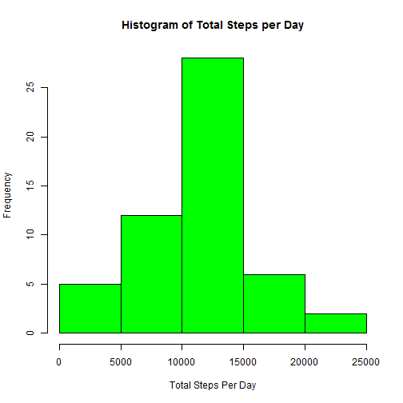
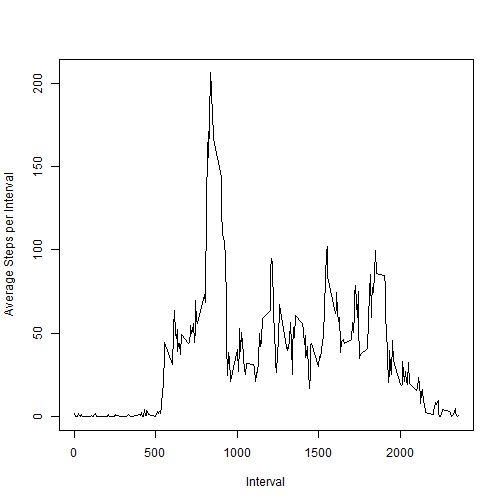
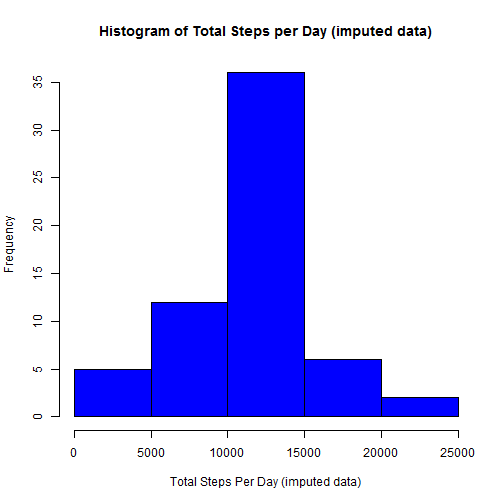
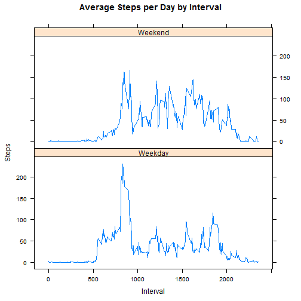

## Loading and preprocessing the data

```r
unzip("activity.zip")
data <- read.csv("activity.csv")
```

## What is mean total number of steps taken per day?

### Calculate total number of steps per day and plot histogram

```r
stepsPerDay<- aggregate(steps ~ date, data,sum )
hist(stepsPerDay$steps, xlab = "Total Steps Per Day" , main="Histogram of Total Steps per Day", col = "green")
```


### Calculate mean and median of total steps per day

```r
meanStepsPerDay <- mean(stepsPerDay$steps, na.rm = TRUE)
medianStepsPerDay <- median(stepsPerDay$steps, na.rm = TRUE)
```

The mean number of steps is 1.0766189 &times; 10<sup>4</sup> and the median is 10765.

## What is the average daily activity pattern?
### Calculate the avg steps per interval for all days and plot a timeseries plot

```r
avgStepsPerInterval <- aggregate(steps ~ interval, data, mean)
plot(avgStepsPerInterval$interval, avgStepsPerInterval$steps, type="l", ylab = "Average Steps per Interval" , xlab = "Interval")
```


##  Which 5-minute interval, on average across all the days in the dataset, contains the maximum number of steps ?

```r
max_interval <- avgStepsPerInterval[which.max(avgStepsPerInterval$steps),1]
max_avg_steps <- avgStepsPerInterval[which.max(avgStepsPerInterval$steps),2]
```
Interval 835 on average across all days contains the maximum avg number of steps = 206.1698113

## Imputing missing values


```r
# count number of missing values
incomplete <- sum(!complete.cases(data))
# replace missing vlauesin data with the average for that interval for all days
imputed_data <- transform(data, steps = ifelse(is.na(data$steps), avgStepsPerInterval$steps[match(data$interval, avgStepsPerInterval$interval)], data$steps))
```

## plot the histogram of total number of steps per day with theimputed data

```r
imputedStepsPerDay<- aggregate(steps ~ date, imputed_data,sum )
#plot histogram of imputed data
hist(imputedStepsPerDay$steps, xlab = "Total Steps Per Day (imputed data)" , main="Histogram of Total Steps per Day (imputed data)", col = "blue")
```



```r
# Calculate new mean and median of the imputed data set
newMean <- mean(imputedStepsPerDay$steps, na.rm = TRUE)
newMedian <- median(imputedStepsPerDay$steps, na.rm = TRUE)

# difference between total daily number of steps between imputed and original data
total_diff <- sum(imputedStepsPerDay$steps) - sum(stepsPerDay$steps)
```

In the imputed data the mean number of steps is 1.0766189 &times; 10<sup>4</sup> and the median is 1.0766189 &times; 10<sup>4</sup>.

The difference between the total daily number of steps between the imputed data and the the original data is 8.6129509 &times; 10<sup>4</sup> steps.

## Are there differences in activity patterns between weekdays and weekends?

```r
library(lattice)
weekdays <- c("Monday", "Tuesday", "Wednesday", "Thursday", "Friday")
imputed_data$dayofweek = as.factor(ifelse(is.element(weekdays(as.Date(imputed_data$date)),weekdays), "Weekday", "Weekend"))

# aggregate mean by interval and dayof week
avgStepsPerIntervalDayofWeek <- aggregate(steps ~ interval + dayofweek, imputed_data , mean)

# generate plot
xyplot(avgStepsPerIntervalDayofWeek$steps ~ avgStepsPerIntervalDayofWeek$interval|avgStepsPerIntervalDayofWeek$dayofweek, main="Average Steps per Day by Interval",xlab="Interval", ylab="Steps",layout=c(1,2), type="l")
```



There is a higher peak earlier on weekdays between interval 500-1000 in excess of 200 steps. The average level of activity(Steps) however seems higher on weekends.

